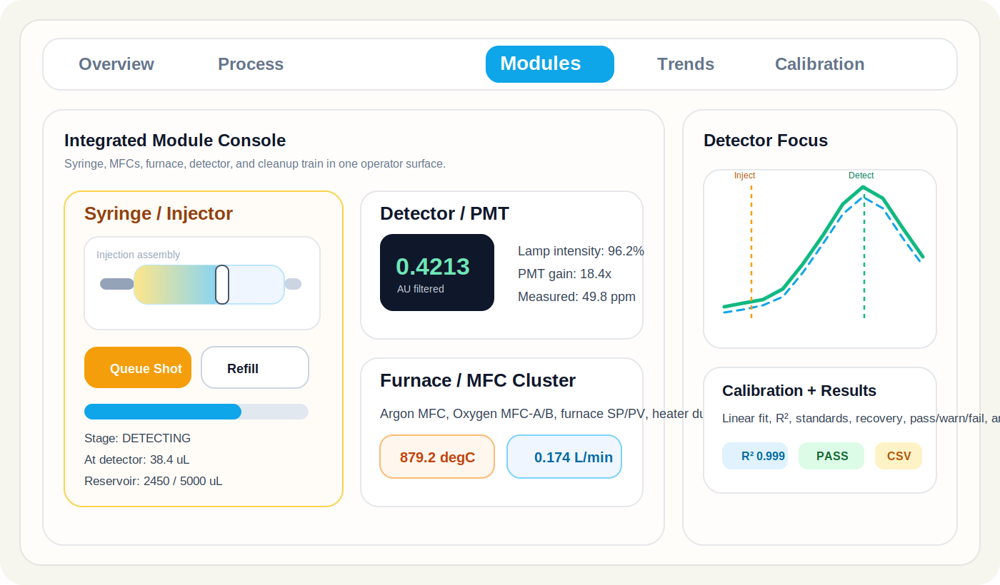
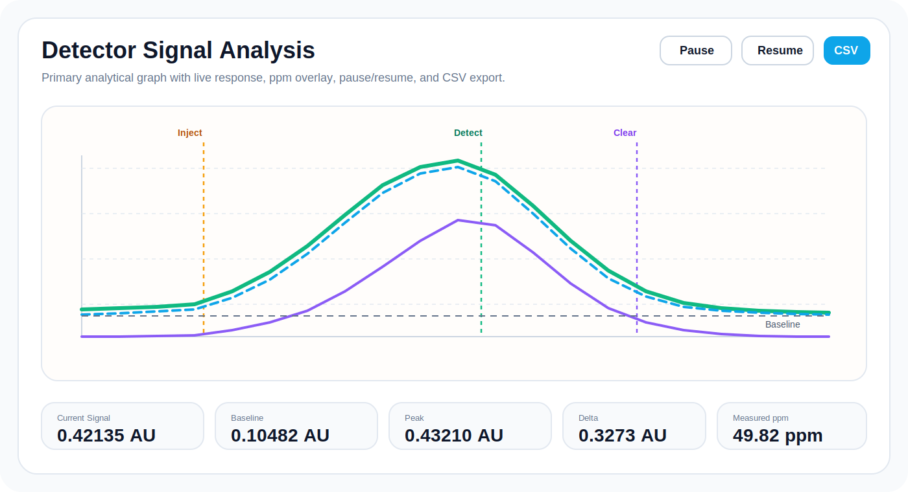

# MFC Combustion Analyzer Simulator

Container-ready operator simulator for an MFC-based combustion analyzer with:

- Integrated module controls for syringe, MFCs, furnace, detector, and cleanup train
- Detector-focused live analysis with pause, resume, baseline/peak view, and CSV export
- Calibration workflow, result release view, and QC-style pass/warn/fail reporting
- Fault injection, state-machine sequencing, and realistic sample transfer stages



## What This Project Is

This project is a browser-based process simulator for an **MFC combustion analyzer**.
It is organized as an operator console focused on process control and analytical review:

- The **syringe/injector** is modeled as the main analytical trigger
- Sample movement is staged through **injector -> furnace -> detector -> clearing**
- The **detector graph** is treated as the main analytical signal, not a secondary chart
- Calibration and result views are organized around the way an operator would verify standards and samples

## Main Screens

### 1. Integrated Module Console

The `Modules` tab is where the process is driven.
Each module has inline controls instead of pushing everything into separate control tabs.

- `Syringe / Injector`: sample selection, shot volume, capacity, refill, auto shot, and manual plunger mode
- `Argon / Oxygen MFCs`: setpoint and operating mode directly inside each module
- `Furnace / Quartz Tube`: SP, display offset, thermal boost, and heater state
- `Detector / PMT`: PMT HV, optics cleanup, lamp aging reset, and live measured ppm
- `Cleanup Train`: saturation, pressure drop, and regeneration action

### 2. Detector Signal Analysis

The detector signal is the most important graph in the simulator, so it has its own primary analysis panel.



What the detector panel gives you:

- Live detector trace
- Model response trace
- Measured ppm overlay
- Event markers for `Inject`, `Detect`, `Clear`, and `Done`
- `Pause / Resume`
- `Export CSV`
- Baseline, peak, and delta readout
- Time window switching: `30s`, `60s`, `120s`, `full`

### 3. Calibration and Results

The app also includes:

- `Calibration` tab for standards, fit, slope, intercept, and `R2`
- `Results` tab for analytical release-style records
- Expected vs measured ppm
- Recovery percentage
- Pass / warn / fail outcome per injection

## Sample Flow Logic

The sample flow is not treated as a single instant jump.
The simulation stages the sample through these phases:

1. `ARMED`
2. `INJECTING`
3. `TRANSFER_TO_FURNACE`
4. `COMBUSTING`
5. `DETECTING`
6. `CLEARING`

This is what drives the detector response, trend markers, and final reported result.

## Installation

Choose **one** of these ways to run the project:

- Docker production
- Docker development with live reload
- Local Node.js without Docker

## Option 1: Docker Production

Use this when you want the fastest and simplest run path.

Requirements:

- Git
- Docker Desktop on Windows, or Docker Engine with Compose on Linux

Copy and run in a shell:

```bash
git clone https://github.com/iceberg-rog/mfc-combustion-analyzer-simulator.git
cd mfc-combustion-analyzer-simulator
docker compose up --build
```

Then open:

```text
http://localhost:3000
```

Run in detached mode:

```bash
git clone https://github.com/iceberg-rog/mfc-combustion-analyzer-simulator.git
cd mfc-combustion-analyzer-simulator
docker compose up --build -d
```

Stop the production container:

```bash
cd mfc-combustion-analyzer-simulator
docker compose down
```

## Option 2: Docker Development With Live Reload

Use this when you want to edit the code and see changes automatically.

Requirements:

- Git
- Docker Desktop on Windows, or Docker Engine with Compose on Linux

Copy and run in a shell:

```bash
git clone https://github.com/iceberg-rog/mfc-combustion-analyzer-simulator.git
cd mfc-combustion-analyzer-simulator
docker compose -f docker-compose.dev.yml up --build
```

Then open:

```text
http://localhost:3000
```

Stop the development container:

```bash
cd mfc-combustion-analyzer-simulator
docker compose -f docker-compose.dev.yml down
```

This mode mounts the project source into the container and enables polling-based file watching so it works reliably across Windows and Linux hosts.

## Option 3: Local Node.js Run

Use this when you do not want Docker.

Requirements:

- Git
- Node.js `22.x`
- npm `10.x` or newer

Copy and run in a shell:

```bash
git clone https://github.com/iceberg-rog/mfc-combustion-analyzer-simulator.git
cd mfc-combustion-analyzer-simulator
npm ci
npm run build
npm run start
```

Then open:

```text
http://localhost:3000
```

## PowerShell Copy-Paste

Windows PowerShell, Docker production:

```powershell
git clone https://github.com/iceberg-rog/mfc-combustion-analyzer-simulator.git
Set-Location mfc-combustion-analyzer-simulator
docker compose up --build
```

Windows PowerShell, Docker development:

```powershell
git clone https://github.com/iceberg-rog/mfc-combustion-analyzer-simulator.git
Set-Location mfc-combustion-analyzer-simulator
docker compose -f docker-compose.dev.yml up --build
```

Windows PowerShell, local Node.js:

```powershell
git clone https://github.com/iceberg-rog/mfc-combustion-analyzer-simulator.git
Set-Location mfc-combustion-analyzer-simulator
npm ci
npm run build
npm run start
```

## npm Shortcuts

After you are already inside the project folder, you can use:

```bash
npm run docker:prod
npm run docker:prod:detached
npm run docker:prod:down
npm run docker:dev
npm run docker:dev:down
```

## Helper Scripts

### PowerShell

```powershell
./scripts/docker-prod.ps1
./scripts/docker-dev.ps1
```

### Shell

```bash
sh ./scripts/docker-prod.sh
sh ./scripts/docker-dev.sh
```

## Direct Docker Commands

Build the production image:

```bash
docker build -t mfc-combustion-analyzer-simulator .
```

Run the image directly:

```bash
docker run --rm -p 3000:3000 --name mfc-combustion-analyzer-simulator mfc-combustion-analyzer-simulator
```

## Repository Structure

Important files:

- `app/page.tsx`: main application shell and tab layout
- `components/simulator/simulator-engine.ts`: core process and detector simulation logic
- `components/simulator/modules-tab.tsx`: integrated module control surface
- `components/simulator/trends-tab.tsx`: detector analysis and supporting process trends
- `components/simulator/calibration-tab.tsx`: calibration workflow
- `components/simulator/results-tab.tsx`: analytical result view
- `Dockerfile`: multi-stage production and development container image
- `docker-compose.yml`: production container
- `docker-compose.dev.yml`: development container

## Standardized Project Name

The project now uses a single consistent name across package metadata, browser metadata, and UI:

```text
MFC Combustion Analyzer Simulator
```
